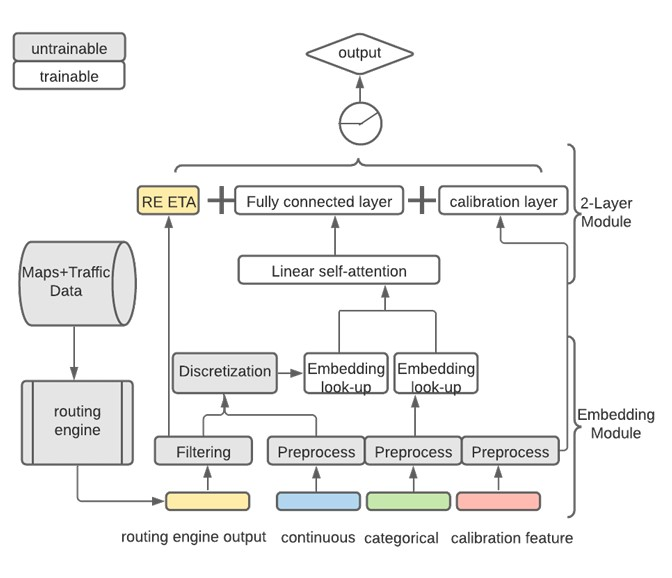

# Uber: Accurate ETA Predictions using DeepETA serving Uber's Businesses 

For many years, Uber's Estimated Time of Arrival (ETA) prediction algorithms were based on gradient-boosted decision tree ensembles. As the training data and models grew subsequently with each release, maintaining the model became difficult. Deep Learning techniques began being researched because they allowed for large datasets processing using data-parallel distributed training paradigms. 

XGBoost had already been quite successful at predicting ETA times, and therefore a switch to deep learning techniques would require addressing three main challenges: 
1. Latency: The model must maintain low latency of a few milliseconds at most. 
2. Accuracy: The model must register a lower mean absolute error (MAE) over the incumbent XGBoost model.
3. Generality: The model must be able to be used cross-functionally across all of Uber's lines of business like mobility and delivery. 

To deliver on these challenges, Uber AI partnered with Uber's Maps team and developed a deep neural network architecture for global ETA prediction. This article highlights some of the learnings from that [paper](https://arxiv.org/abs/2206.02127?uclick_id=ddaf1042-c35c-460a-9caa-49dd89f2f23f).

## Introduction

The most common method of ETA estimation is with a routing engine, called a route planner. Route planners divide the road networks up into individual road segments, and use shortest-path algorithms to calculate shortest paths between origin and destination. Weighted edges on a graph represent these road segments, and summing these weights over the shortest path gives the ETAs. Traffic patterns, accidents and weather are all considered in modern routing engines. 

The Uber AI approach to ETA prediction uses ML to predict the residuals between routing engine ETA and real-world observed outcomes. 

Based on post-processing machine learning, the model at Uber predicts ETA residuals by considering spatial and temporal features, including origin, destination, request time, real-time traffic, and request nature. Its core objective is to maintain speed to minimize latency in ETA requests while continually improving accuracy measured by MAE across data segments.

Out of the seven different neural network architectures that were tested, Uber found that a shallow encoder-decoder architecture with a linear self-attention yielded the most accurate results. 

Self-attention has been used originally in the context of image processing or natural language processing. For tabular data problems like ETA predictions, the problem statement was defined thus: each feature, such as trip start time of day, origin of trip, is a vector. Self-attention calculates the interaction effects of these K features, stores an intermediate K*K matrix, and outputs the representation of this feature as a weighted sum of all features. In contrast to NLP problems, there is no positional encoding. Multiple attention heads focus one shorter form of each feature's representation across all other features. Thus, the feature <i>speed</i> can be more closely associated with the feature <i>traffic</i> in one head, and with the feature <i>city</i> in another head. 

## Feature Encoding

Continuous features were bucketed in a quantile bucketing strategy, rather than equal bucket sizes, to improve accuracy. Categorical features were embedded using an embedding look-up operation. 

Geospatial features such as origin and destination latitudes and longitudes, were transformed using geohashing and multiple feature hashing techniques. 

---
All information in this blog summary is obtained from the [Uber Engineering Blog](https://www.uber.com/blog/deepeta-how-uber-predicts-arrival-times/?uclick_id=ddaf1042-c35c-460a-9caa-49dd89f2f23f)
